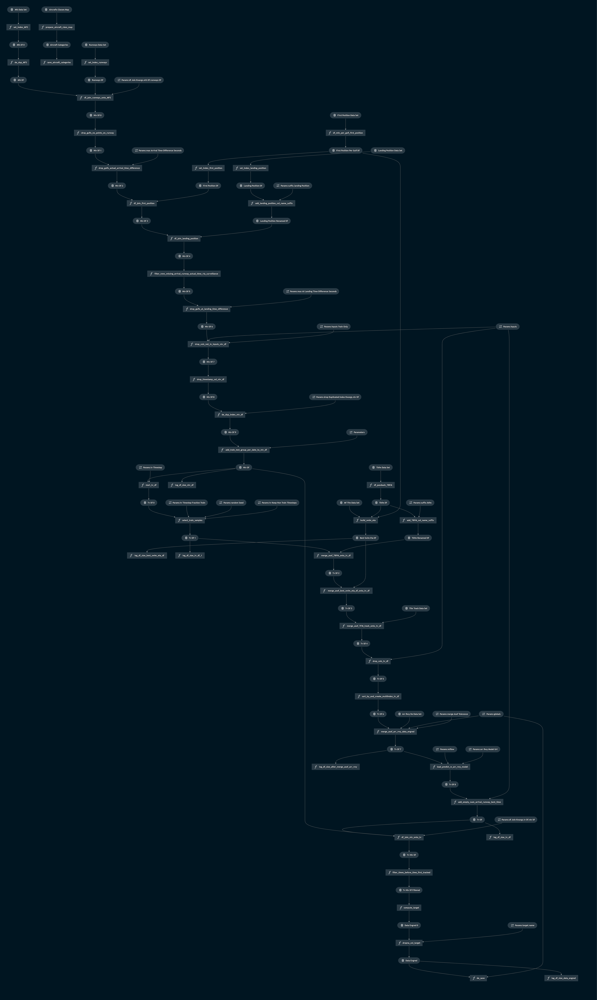
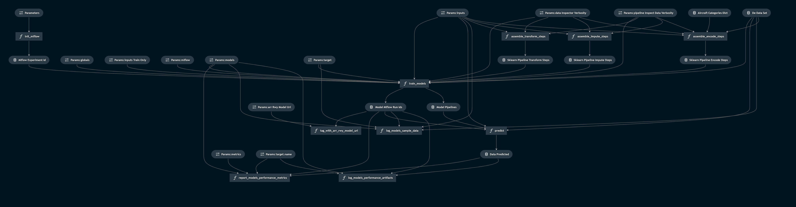

 
## Estimated On Time Prediction

The ML-airport-estimated-ON software is developed to provide a reference implementation to serve as a research example how to train and register Machine Learning (ML) models intended for predicting landing time. The software is designed to point to databases which are not provided as part of the software release and thus this software is only intended to serve as an example of best practices. The software is built in python and leverages open-source libraries kedro, scikitlearn, MLFlow, and others. The software provides examples how to build three distinct pipelines for data query and save, data engineering, and data science. These pipelines enable scalable, repeatable, and maintainable development of ML models.

## ML Airport Surface Model Background Information

The ML-airport-estimated-ON model is one of several ML models tied together by the Airport Surface Model Orchestrator shown below.

 

The Airport Surface Model Orchestrator runs at fixed intervals and is driven from real-time Fused FAA System Wide Information Management (SWIM) data feeds and also pulls in additional D-ATIS airport configuration data and weather data. The data input manager within the Orchestrator prepares data for each ML service and data is exchanged between the Orchestrator and the ML services via API interfaces.

The input data sources for the individual ML prediction services are shown in the below diagram which also illustrates dependencies between the individual ML services.


The ML Airport Surface Model forms the building blocks of a cloud based predictive engine that alerts flight operators to pre-departure Trajectory Option Set (TOS) reroute opportunities within the terminal airspace. The ML Airport Surface Model was designed to be a scalable replacement for the capabilities provided by NASA's Surface Trajectory Based Operations (STBO) subsystem, which is a component of the fielded ATD2 Phase 3 System in the North Texas Metroplex. The STBO subsystem relies heavily upon detailed adaptation, which defines the physical constraints and encodes Subject Matter Expert knowledge within decision trees, and creates a costly bottleneck to scaling the pre-departure TOS digital reroute capability across the National Airspace System.


Taxi-Out Prediction is part of a suite of softwares designed to model the airport surface :
- [ML-airport Airport Configuration Model](https://github.com/nasa/ML-airport-configuration)
- [ML-airport Arrival Runway Model](https://github.com/nasa/ML-airport-arrival-runway)
- [ML-airport Departure Runway Model](https://github.com/nasa/ML-airport-departure-runway)
- [ML-airport Taxi-In Model](https://github.com/nasa/ML-airport-taxi-in)
- [ML-airport Taxi-Out Model](https://github.com/nasa/ML-airport-taxi-out)
- [ML-airport Estimated-On-Time Model](https://github.com/nasa/ML-airport-estimated-ON)
- [ML-airport Data Services](https://github.com/nasa/ML-airport-data-services)

# Estimated On Time Service

Models for predicting landing (i.e., wheels on) times.

## Project heritage

This is a Kedro + MLflow project.
The project was generated using Kedro 0.16.0 by running the interactive command line interface provided by Kedro.
```
kedro new
```

After creation of the project, some adjustments were made to `src/eon_service/run.py` to enable the [Kedro templating configurations capability](https://kedro.readthedocs.io/en/stable/04_kedro_project_setup/02_configuration.html#templating-configuration) we use to handle configurations for different airports.
See the "Per-airport Globals" section below for details.
Further adjustments to `src/eon_service/run.py` were made to enable "batch mode" runs of pipelines.
See the "Batch Mode Pipeline Runs" section below for details.

After creation of the project, Kedro was also manually updated to version 0.16.4.

## Steps to start using this project<br>(and some helpful information about Kedro + MLflow projects)

In addition to the steps below, take a look at the [Kedro documentation](https://kedro.readthedocs.io) and the [MLflow documentation](https://mlflow.org/docs/latest/index.html) for more help getting started.

### Set up the project conda environment

Create the conda environment for this project using the `conda.yaml` specification.
```
conda env create -f conda.yaml
```
Then activate the environment.
```
conda activate eon-service-env
```

### Configure Kedro

*Credentials*
credentials.yml defines username, host, port to access a database which we assume has FUSER data.
A Kedro `credentials.yml` file needs to be created in `conf/local/`.
An example of such a file is in `credentials-template.yml`.

*Per-airport Globals*

In this project, each model is trained for a particular airport.
The airport and potentially airport-specific items are specified in `conf/base/globals.yml` or `conf/base/<airport_icao>.globals.yml`, where `<airport_icao>` is the ICAO idenitifier for an airport (e.g., KCLT).
Which particular `globals.yml` is used is specified at run time as a parameter specified in the `kedro run` or `mlflow run` command line interfaces (described below).
This approach is based on [Kedro's templated configurations capability](https://kedro.readthedocs.io/en/stable/04_kedro_project_setup/02_configuration.html#templating-configuration).
Implementing it required us to overwrite the `_create_config_loader` method in `src/eon_service/run.py` to use a [TemplatedConfigLoader](https://kedro.readthedocs.io/en/stable/kedro.config.TemplatedConfigLoader.html) in a way similar to what is described in the Kedro documentation, but extended to allow for the `global_config_yml` command line interface parameter.

If using Kedro's Jupyter notebook or IPython integrations, the overall `globals.yml` is always used (i.e., there is not currently any way to specify which airport-specific `<airport_icao>.globals.yml` to use when initiating the Jupyter notebook session).
The overall `globals.yml` can be updated during a Jupyter or IPython session (e.g., to specify a different airport) if, after changing the file, the `%reload_kedro` command is executed in the Jupyter notebook or IPython console session.
This will update the Kedro `context` variable to take into account the updated `globals.yml`.
See the "Working with Kedro from notebooks or IPython" section below and the [relevant Kedro documentation](https://kedro.readthedocs.io/en/stable/11_tools_integration/02_ipython.html) for additional information about Kedro's Jupyter and IPython capabilities.

*Parameters*

The `conf/base/parameters.yml` file contains any parameters that control various aspects of the pipelines that engineer data and train and test models.
For example, the `models:` section in the parameters file specifies with type of machine learning models should be used and what hyperparameters will control their training.
You may wish to update some of these parameters.
Items in `parameters.yml` that are surrounded by `${` and `}` will be imported from the `globals.yml`.
[Kedro's configuration templating documentation](https://kedro.readthedocs.io/en/stable/04_kedro_project_setup/02_configuration.html#template-configuration) provides additional information about templated configurations via `globals.yml`.

*Data Catalog*

Any data sets used in this Kedro project must be declared in the `conf/base/catalog.yml` "data catalog."
There should not be any reason for you to update this data catalog, but it contains items surrounded by `${` and `}` that will be imported from the `globals.yml` specified for a particular run.
[Kedro's configuration templating documentation](https://kedro.readthedocs.io/en/stable/04_user_guide/03_configuration.html#templating-configuration) provides additional information.

*Kedro Nodes & Pipelines*

[Kedro pipelines](https://kedro.readthedocs.io/en/stable/02_get_started/03_hello_kedro.html#pipeline) specify a directed acyclic graph of [Kedro nodes](https://kedro.readthedocs.io/en/stable/02_get_started/03_hello_kedro.html#node) to be run, with various data sets declared in the `catalog.yml` or parameters specified in `parameters.yml` serving as inputs.
Other than parameters or data sets declared in the data catalog, model inputs can be names of objects that are output from other nodes, such as intermediate data sets or trained models.
The overall project pipelines are defined in `src/eon_service/pipeline.py`.
These are defined by combining partial pipelines defined in other places throughout the project.
Nodes are simply wrappers around functions, which in turn can be defined or imported from anywhere, but are often and conventionally defined in various `nodes.py` files in various directories throughout the project.
Some functions used in nodes come from the `data_services` repository.

### Configure MLflow

*MLflow server*

MLflow can be configured to track runs locally or remotely on a server.

*MLflow API*

Throughout the code are some [MLflow API](https://www.mlflow.org/docs/latest/python_api/index.html) calls.
These do things like log run parameters and metrics to the MLflow server or log run artifacts (e.g., pickled trained models) to the MLflow artifact store.


## Getting and preparing data

*Data Query and Save Pipeline*

Most of the data required to run train models in this project can be acquired by running "data query and save" (DQS) pipelines.
These run some queries per data set declarations in `conf/base/catalog.yml` (with some aspects of these declarations imported from the specified `conf/base/<airport_icao>.globals.yml`), accessing databases per credentials in `conf/local/credentials.yml`, and save resulting CSVs locally in the `data/` folder (typically in the `01_raw/` subfolder).
The CSV data set naming convention puts the relevant airport ICAO code as a prefix (e.g., if running with a `KJFK.globals.yml` for KJFK, then the data sets will be named things like `data/01_raw/KJFK.MFS_data_set.csv`).
The data engineering pipeline starts from those CSVs.
These commands do not need to be rerun over and over for the same airport and time period; once they have been run, all the corresponding data will be available in the CSVs in the `data/` folder.

Since the data query and save pipeline runs queries that retrieve and then save to disk potentially large amounts of data, they can take tens of minutes to hours to run, depending in particular on the duration of time between `start_time` and `end_time` in `globals.yml`.
To track pipeline run progress during these potentially long runs, Kedro informational logging statements will be printed to the screen.

To run the data query and save pipeline, run the command below from the `eon-service/` directory.
```
kedro run --pipeline dqs --params global_config_yml:<airport_icao>.globals.yml
```
The `<airport_icao>` must be replaced so that the final input specifies an airport-specific `globals.yml` available in `conf/base/`.

*Preparing arrival runway prediction data and model*

One input available to the models developed here is the runway that the flight is predicted to land on, as of the time of the prediction.
This input is called `predicted_arrival_runway` in the code base.
The arrival runway predictions are provided by a model trained with code in the [`ML-airport-arrival-runway` repository](https://github.com/nasa/ML-airport-arrival-runway)
There are a few steps required to incorporate these predictions into the data engineering for this project:

1. Clone and set up the [`ML-airport-arrival-runway` repository](https://github.com/nasa/ML-airport-arrival-runway), per instructions in its readme.
The project should be cloned into the directory where this project was cloned.
2. Ensure that the `<airport_icao>.globals.yml` parameters in `ML-airport-arrival-runway` and `ML-airport-estimated-ON` match up.
In particular, they should reference the same `start_date`, `end_date`, and `known_runways`, and need to have identical `batch_mode` settings (covered later in this document).
3. Run the `ML-airport-arrival-runway` data query and save and data engineering pipelines using commands just like those used to run those pipelines in this project.
This should create a data set engineered for usage by the arrival runway prediction model at `../ML-airport-arrival-runway/data/05_model_input/<airport_icao>.de_data_set.csv`.
If batch mode is used, a set of these files for different date ranges will be created.
4. Ensure that the `eon-service-env` created for this project includes any packages that arrival runway prediction models require to make predictions; these are specified in `conda.yml` in `ML-airport-arrival-runway`.
5. Specify which arrival runway prediction model to load from MLflow via the `arr_rwy_model_uri` entry in `parameters.yml`.
See [the relevant MLflow documentation](https://mlflow.org/docs/latest/python_api/mlflow.sklearn.html#mlflow.sklearn.load_model) for more information about using model URIs to load models from the MLflow server.
A best practice to avoid ambiguity about which model was used during training is to specify model URI that corresponds to a particular model (e.g., `models:/arrival_runway_${globals.airport_icao}/3`, which specifies version 3 of the registered models with name `arrival_runway_${globals.airport_icao}`), rather than one that will load different models at different times (e.g., `models:/arrival_runway_${globals.airport_icao}/Staging`, which loads whichever model is in the "Staging" stage at the time of loading).

When the data engineering pipeline is run for this project, it will load and join in the data set that was engineered for the arrival runway model.
Then an arrival runway prediction model will be loaded from the MLflow server.
That model will be used to predict the arrival runway for various flights and at various times.
These predictions will be incorporated into the engineered data set that is used for training and evaluating actual landing time prediction models in this project.

If these steps seem prohibitive, you may simply remove the `predicted_arrival_runway` entry from the `inputs:` section in `parameters.yml` to train models that are not provided with this input.
Then any nodes related to the arrival runway prediction model will need to be removed from the data engineering pipeline described in the next sub-section.

*Data Engineering Pipeline*

After running the data query and save pipeline for this project and preparing the arrival runway data and model, you are ready to engineer the data for this project.
To do so, run the command below from the `ML-airport-estimated-ON/` directory.
```
kedro run --pipeline de --params global_config_yml:<airport_icao>.globals.yml
```
This pipeline will work from the raw data saved in the `data/01_raw/` directory, as well as the engineered arrival runway data in `../ML-airport-arrival-runway/data/05_model_input/` (the directory is defined in the `./conf/base/catalog.yml` for arr_rwy_de_data_set@CSV), to engineer a data set that will be saved off as a pickled pandas `DataFrame` in the `data/05_model_input/` directory as `<airport_icao>.de_data_set.pkl`.

*"Batch Mode" Pipeline Runs*

To break up queries and data engineering calculations into more computationally-tractable "batches", "batch mode" may be used on the data query and save and data engineering pipelines.
To use batch mode, specify a `batch_mode:` section in `<airport_icao>.globals.yml` (this section is already provided in these files).
This section needs to at least specify the length of the batches in days (`batch_days`), the number of days that they overlap (`overlap_days`), and a list specifying which pipelines are to be batched (`pipelines`).
A batch mode pipeline run will actually run the pipeline multiple times, and each of these will create output file(s) that hold data from the date range for the batch.
Even when batch mode is used, the data engineering pipeline still produces a single engineered data set with data from all dates.
This final engineered data set (`data/05_model_input/<airport_icao>.de_data_set.pkl`) serves as the starting point for the data science pipeline.

## Training models

After the engineered data is ready, you can train models by running the command below from the `ML-airport-estimated-ON/` directory.
```
kedro run --pipeline ds --params global_config_yml:<airport_icao>.globals.yml
```
The models to be trained are specified in the `models:` section in `parameters.yml`.
Each model will be trained in a separate MLflow run that will be logged to the "actual_on" experiment on the MLflow server.

## Working with Kedro from notebooks or IPython

In order to use Jupyter notebooks or IPython in your Kedro project, you need to install Jupyter from within the project's conda environment:

```
conda install jupyter
```

For using Jupyter Lab, you need to install it:

```
conda install jupyterlab
```

After installing Jupyter and/or Jupyter Lab, you can start a local notebook server:

```
kedro jupyter notebook
```

You can also start Jupyter Lab:

```
kedro jupyter lab
```

And if you want to run an IPython qtconsole session:

```
kedro ipython qtconsole
```

Staring Jupyter or IPython this way executes a startup script in `.ipython/profile_default/startup/00-kedro-init.py`.
This creates a Kedro `context` variable in scope; the `context` can be used to access the data catalog, parameters, execute pipelines or portions thereof, and more.
See the [relevant Kedro documentation](https://kedro.readthedocs.io/en/stable/11_tools_integration/02_ipython.html) for details.

In each of these cases, the session uses the global settings (e.g., airport ICAO) in `conf/base/globals.yml` to populate various items in `parameters.yml` and `catalog.yml`.
If you wish to adjust those global settings after starting up a Jupyter notebook or an IPython session, simply change the contents of `globals.yml` and run the `%reload_kedro` line magic command.

Project notebooks are kept in the `notebooks/` directory.
Per the [cookiecutter data science conventions](https://drivendata.github.io/cookiecutter-data-science/#notebooks-are-for-exploration-and-communication), notebooks are used for exploration and communication and named based on analysis order and notebook owner (e.g., `01.3-mjb-visualize-distributions.ipynb`).

## Visualizing pipelines with Kedro Viz

The [Kedro viz tool](https://github.com/quantumblacklabs/kedro-viz) can be used to visualize Kedro pipelines.
To use it, first install it in the project environment via pip.
```
pip install kedro-viz
```
Then, from the top-level `eon-service/` directory, visualize a pipeline by providing its name after the `--pipeline` command line interface command.
For example, running the command below
```
kedro viz --pipeline de
```
will initialize the Kedro Viz server and point you to a URL at which you can interact with the HTML visualization of the pipeline.
Kedro Viz pipeline visualizations can be exported.
The exported data engineering and data science pipeline visualizations (as of 30 October 2020) are shown below.

*Data engineering pipeline*


*Data science pipeline*


## Rules and guidelines<br/>(suggested by Kedro developers)

In order to get the best out of the template:

 * Please don't remove any lines from the `.gitignore` file we provide
 * Make sure your results can be reproduced by following a data engineering convention, e.g. the one we suggest [here](https://kedro.readthedocs.io/en/stable/12_faq/01_faq.html?highlight=data%20engineering%20convention#what-is-data-engineering-convention)
 * Don't commit any data to your repository
 * Don't commit any credentials or local configuration to your repository
 * Keep all credentials or local configuration in `conf/local/`


## Copyright and Notices

The ML-airport-estimated-ON code is released under the [NASA Open Source Agreement Version 1.3 license](license.pdf)


## Notices

Copyright © 2021 United States Government as represented by the
Administrator of the National Aeronautics and Space Administration.
All Rights Reserved.

### Disclaimers

No Warranty: THE SUBJECT SOFTWARE IS PROVIDED "AS IS" WITHOUT ANY
WARRANTY OF ANY KIND, EITHER EXPRESSED, IMPLIED, OR STATUTORY,
INCLUDING, BUT NOT LIMITED TO, ANY WARRANTY THAT THE SUBJECT SOFTWARE
WILL CONFORM TO SPECIFICATIONS, ANY IMPLIED WARRANTIES OF
MERCHANTABILITY, FITNESS FOR A PARTICULAR PURPOSE, OR FREEDOM FROM
INFRINGEMENT, ANY WARRANTY THAT THE SUBJECT SOFTWARE WILL BE ERROR FREE,
OR ANY WARRANTY THAT DOCUMENTATION, IF PROVIDED, WILL CONFORM TO THE
SUBJECT SOFTWARE. THIS AGREEMENT DOES NOT, IN ANY MANNER, CONSTITUTE AN
ENDORSEMENT BY GOVERNMENT AGENCY OR ANY PRIOR RECIPIENT OF ANY RESULTS,
RESULTING DESIGNS, HARDWARE, SOFTWARE PRODUCTS OR ANY OTHER APPLICATIONS
RESULTING FROM USE OF THE SUBJECT SOFTWARE.  FURTHER, GOVERNMENT AGENCY
DISCLAIMS ALL WARRANTIES AND LIABILITIES REGARDING THIRD-PARTY SOFTWARE,
IF PRESENT IN THE ORIGINAL SOFTWARE, AND DISTRIBUTES IT "AS IS."

Waiver and Indemnity: RECIPIENT AGREES TO WAIVE ANY AND ALL CLAIMS
AGAINST THE UNITED STATES GOVERNMENT, ITS CONTRACTORS AND
SUBCONTRACTORS, AS WELL AS ANY PRIOR RECIPIENT.  IF RECIPIENT'S USE OF
THE SUBJECT SOFTWARE RESULTS IN ANY LIABILITIES, DEMANDS, DAMAGES,
EXPENSES OR LOSSES ARISING FROM SUCH USE, INCLUDING ANY DAMAGES FROM
PRODUCTS BASED ON, OR RESULTING FROM, RECIPIENT'S USE OF THE SUBJECT
SOFTWARE, RECIPIENT SHALL INDEMNIFY AND HOLD HARMLESS THE UNITED
STATES GOVERNMENT, ITS CONTRACTORS AND SUBCONTRACTORS, AS WELL AS ANY
PRIOR RECIPIENT, TO THE EXTENT PERMITTED BY LAW.  RECIPIENT'S SOLE
REMEDY FOR ANY SUCH MATTER SHALL BE THE IMMEDIATE, UNILATERAL
TERMINATION OF THIS AGREEMENT.
  